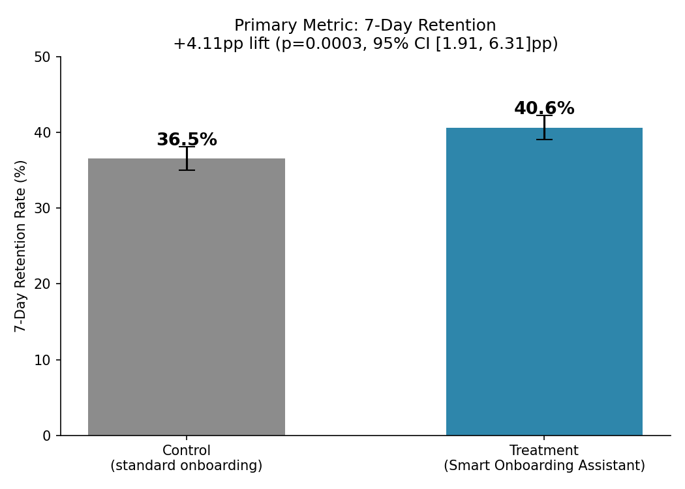
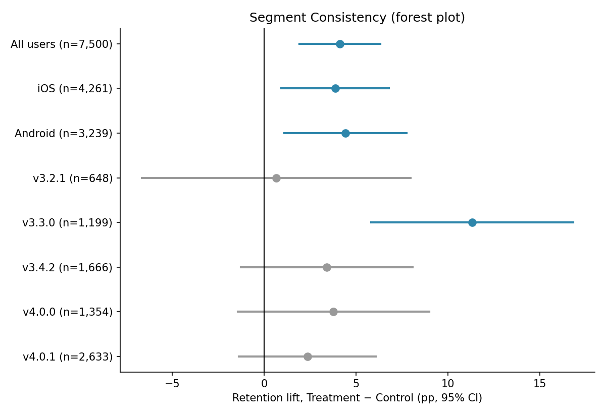

# A/B Testing & Product Experimentation Case Studies


Two product experiments, analyzed the way I'd want them analyzed if my own ship decision depended on it: randomization checked before I trusted a single number, confidence intervals reported next to every p-value, and the difference between "the assignment caused this" and "the people who opted in looked different" kept in front of the reader the whole time.

| Case study | Question | Result |
|---|---|---|
| [Landing Page Redesign](landing-page/) | Does the new landing page convert more visitors? | +1.35pp conversion lift, p = 0.0013 |
| [Smart Onboarding Assistant](smart-onboarding/) | Does guided onboarding improve 7-day retention? | +4.11pp retention lift, p = 0.0003 |

Both datasets are synthetic, built to behave like real experiment data (proper randomization, realistic noise, an underpowered design, a segment that looks significant but isn't a real finding). The goal is to show how I work through an experiment end to end, not to claim these are numbers from a real company.

---

## Why these two experiments live in one repo

A product team runs an A/B test and gets two numbers: a control rate and a treatment rate. The hard part was never computing the difference. It's answering the two questions that actually decide whether something ships:

1. Is the difference real, or is it noise from a 50/50 coin flip that happened to land uneven?
2. If it's real, is it big enough to justify building and maintaining the thing?

Both case studies here walk through the same discipline to answer those questions: check the experiment before reading the metric, run the primary test, quantify uncertainty with a confidence interval, look for effects that don't hold up under segmentation, and translate the result into a number a VP can act on.

---

## Landing Page Redesign

8,200 visitors, 42-day test, one question: does the redesigned landing page convert more visitors than the existing one?

- Control converted at 3.08%, Treatment at 4.44% — a lift of **+1.35pp** (+43.9% relative), p = 0.0013, 95% CI [0.53pp, 2.18pp]
- Bounce rate dropped from 64.6% to 57.9% and median time on page rose from 16.9s to 20.0s — engagement moved the same direction as conversion, which is what you want to see
- The lift held up across every device and traffic source segment tested; nothing looked platform-specific
- A day-by-day p-value trace shows the result crossing the 0.05 line multiple times before the test finished, which is the whole argument for pre-registering a stop date instead of peeking

Full writeup: [landing-page/README.md](landing-page/README.md)

## Smart Onboarding Assistant

7,500 new mobile users, D7 retention flat at ~36% for three quarters, one bet: a guided first-session flow gets more of them to a useful moment before they churn.

- Control retained 36.54%, Treatment retained 40.65% — a lift of **+4.11pp** (+11.3% relative), p = 0.0003, 95% CI [1.91pp, 6.31pp]
- Session length and screens viewed both went up, not just held steady, which corroborates the retention number instead of leaving it standing alone
- The test ran at ~76% power against its own 3pp minimum-detectable-effect target — worth flagging honestly rather than pretending the design was perfect
- Only 37.8% of Treatment users ever touched the Assistant, and the entire lift traces back to that group. That's not a caveat that weakens the result — it's the next experiment: fix discoverability, not the feature.

Full writeup: [smart-onboarding/README.md](smart-onboarding/README.md)

<p align="center">
  
  
</p>

---

## The statistical decisions and why I made them

**Two-proportion z-test for both primary metrics.** Both outcomes are binary (converted / didn't, retained / didn't) with large enough samples per arm for the normal approximation to hold. It's also the test a product VP can sanity-check against an online calculator in thirty seconds, which matters when you're the one defending the number in a room.

**Mann-Whitney U for engagement metrics, not a t-test.** Session length and screens viewed are right-skewed (skew of 3.3–3.6) with a hard cap from the logging system. A t-test on that distribution would technically run, but the mean gets dragged around by a handful of very long sessions. I ran Welch's t-test alongside it as a check — both agreed — but Mann-Whitney is the test I'd defend if someone pushed back.

**Confidence intervals over point estimates for the business case.** A point estimate is the single most likely number; the CI is the range you'd actually be willing to bet on. In the onboarding test, the point estimate (+4.11pp) clears the leadership's 3pp ship bar but the CI's lower bound (+1.91pp) doesn't. That gap is a real conversation, not a rounding error, and it's covered directly in that case study's writeup instead of glossed over.

**Bonferroni correction on every segment cut.** Testing seven app-version and device segments at α = 0.05 each pushes the family-wise false positive rate toward 30%. Correcting to α = 0.0071 is what keeps a genuinely noisy cell (v3.3.0's +11.3pp, n≈1,200, no product explanation) from getting written up as a finding.

**Intent-to-treat as the primary analysis, adopter analysis kept clearly separate.** Comparing everyone in their assigned arm is the only comparison that answers "what happens if we ship this to 100% of users." Comparing adopters to non-adopters is comparing two groups that chose themselves into their own behavior, and no amount of statistical polish turns that into a causal claim. Both numbers are reported in the onboarding case study; only one of them is load-bearing for the ship decision.

More detail, including the actual power calculations and the assumptions behind each test, is in [METHODOLOGY.md](METHODOLOGY.md).

---

## What's actually in this repo

```text
AB-Testing/
├── README.md
├── METHODOLOGY.md
├── DATA_DICTIONARY.md
├── .gitignore
│
├── landing-page/
│   ├── README.md
│   ├── analysis.ipynb
│   ├── landing_page_ab_test_dataset.csv
│   ├── landing_page_test_summary.csv
│   ├── landing_page_visitor_level.csv
│   └── landing_page_ab_dashboard.pbix
│
└── smart-onboarding/
    ├── README.md
    ├── analysis.ipynb
    ├── mobile_app_ab_test_dataset.csv
    └── images/
```

| Tool | What I used it for |
|---|---|
| Python (pandas, NumPy, SciPy, statsmodels, matplotlib) | Data validation, hypothesis testing, power analysis, charts |
| Jupyter | The full analysis pipeline, reproducible top to bottom |
| Power BI | The landing-page executive dashboard |
| Git/GitHub | Version control and this portfolio |

To rerun either notebook: `pip install pandas scipy statsmodels matplotlib numpy` then open `analysis.ipynb` and run all cells.

---

## Limitations, stated up front rather than buried

- Both datasets are synthetic. They're built to reproduce real experimental structure, but they are not evidence about a real company's actual users.
- Financial impact figures are scenario models built on stated assumptions (traffic volume, value per conversion, value per retention point), not observed revenue.
- The onboarding test ran under its target power. I lean on the CI's lower bound for the business case specifically because of this, and I say so in that writeup rather than quoting only the headline lift.
- Segment-level findings are exploratory unless a segment was pre-specified and independently powered. The v3.3.0 outlier in the onboarding data is a flagged curiosity, not a finding — see the segment analysis for why.
- Seven-day retention and a 42-day conversion window are early proxies. A real rollout would need a holdback period to confirm the effect survives past the novelty window.

---

## About this project

I built this to practice — and show — the part of A/B testing that isn't the test itself: deciding whether a result is trustworthy before reading it, being honest about a design's weak points instead of hiding them in an appendix, and turning a p-value into a sentence a non-technical stakeholder can act on.

**Daniel Olatunji**
Data & Business Intelligence · Analytics Engineering · CRM & Automation
[oluwafikayore@gmail.com](mailto:oluwafikayore@gmail.com)
